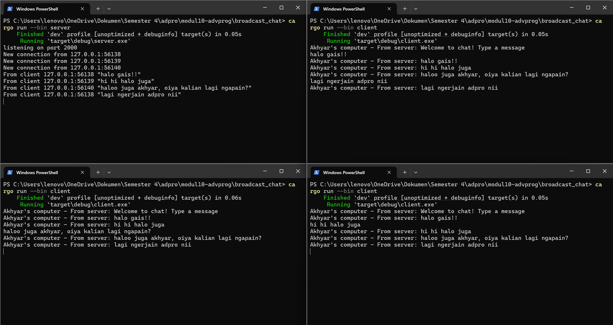

Advance Programming
# Module 10 - Asynchronous Programming (Broadcast Chat) 📘

- Nama    : Akhyar Rasyid Asy syifa
- Kelas   : Advance Programming - A
- NPM     : 2306241682

## Reflection
### Experiment 2.1: Original code, and how it run



Pada gambar tsb, ditunjukkan bahwa server berhasil menghubungkan dirinya dengan client melalui koneksi WebSocket. disana saya mengujicobakannya dengan mencoba membuka 1 terminal as server menjalankan `server.rs` terlebih dahulu dengan command ```cargo run --bin server``` dan diikuti 3 terminal lain as client dengan menjalankan `client.rs` dengan command ```cargo run --bin client```. Nah, nantinya setiap kali client terhubung, server akan mencatat alamat IP dan port sumber. Kemudian ketika salah satu client mengirimkan pesan, pesan tersebut akan diterima oleh server, lalu server akan membroadcast pesan tersebut ke semua client yang sedang terhubung, termasuk client pengirimnya sendiri. 
