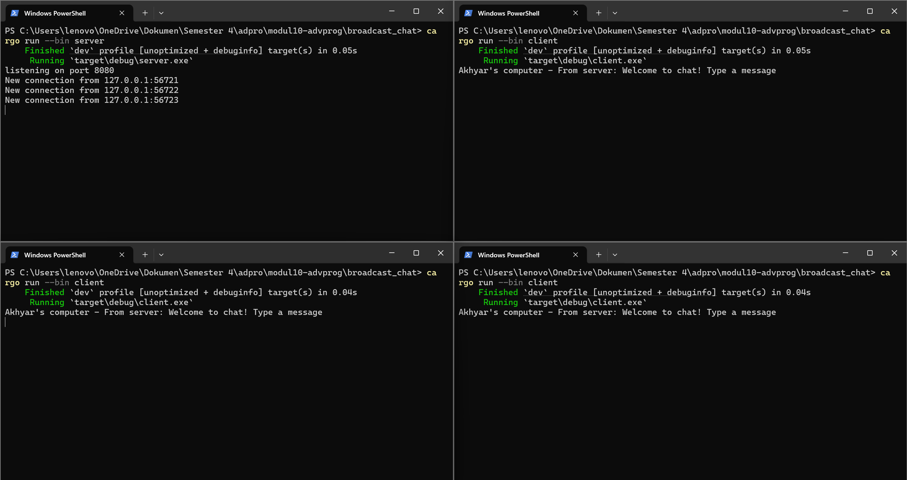

Advance Programming
# Module 10 - Asynchronous Programming (Broadcast Chat) 📘

- Nama    : Akhyar Rasyid Asy syifa
- Kelas   : Advance Programming - A
- NPM     : 2306241682

## Reflection
### Experiment 2.1: Original code, and how it run


Pada gambar tsb, ditunjukkan bahwa server berhasil menghubungkan dirinya dengan client melalui koneksi WebSocket. disana saya mengujicobakannya dengan mencoba membuka 1 terminal as server menjalankan `server.rs` terlebih dahulu dengan command ```cargo run --bin server``` dan diikuti 3 terminal lain as client dengan menjalankan `client.rs` dengan command ```cargo run --bin client```. Nah, nantinya setiap kali client terhubung, server akan mencatat alamat IP dan port sumber. Kemudian ketika salah satu client mengirimkan pesan, pesan tersebut akan diterima oleh server, lalu server akan membroadcast pesan tersebut ke semua client yang sedang terhubung, termasuk client pengirimnya sendiri. 

### Experiment 2.2: Modifying port


di balik gambar ini, saya mensimulasikan merubah  port client pada `ClientBuilder::from_uri` saja dari 2000 menjadi 8080. ketika port pada client diubah menjadi 8080, client akan mencoba terhubung ke websocket di port tersebut. Namun karena server masih menggunakan port 2000, koneksi gagal dan muncul error _ConnectionRefused_, karena tidak ada server yang aktif di port 8080.


Nah disini, jika ingin tetap bekerja, maka websocket port untuk server tepatnya di `TcpListener::bind` harus diubah dari port 2000 ke port 8080 juga agar dapat mengirimkan pesan ke port yang sama dengan server. Dengan demikian, pengiriman dan penerimaan pesan tetap berjalan secara lancar dan akan baik-baik saja seperti sebelumnya.